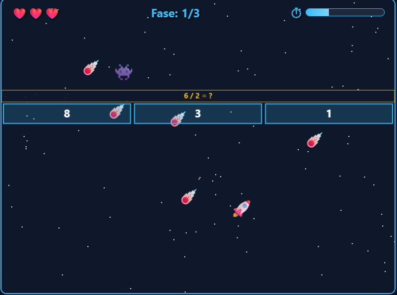
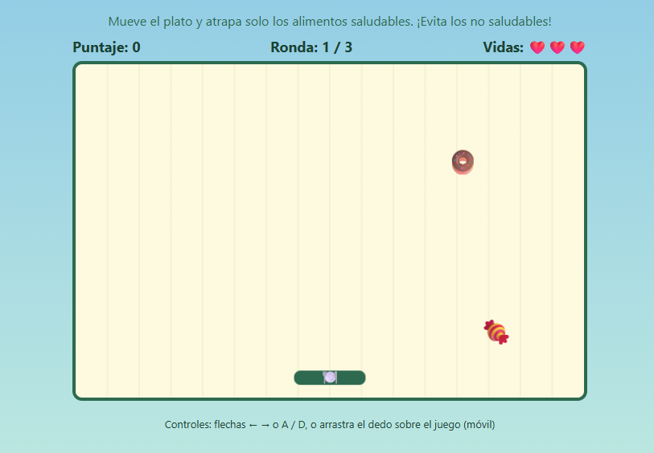

# 🎮 Mi Portafolio de Desarrollo de Videojuegos

## 👤 Presentación
¡Hola! Soy **BLOMY**. 
* **Mis intereses:** Me apasiona el arte en los videojuegos y descubrir nuevas mecánicas[cite: 1].
* **Sobre mí:** Soy un estudiante de cuarto semestre de Ingeniería en sistemas me gustan juegos como FNAF , the division, tunic,stadew valey y un repertorio por su arte en el destacar con mecánicas nuevas y totalmente inversivas.  [cite: 1].

---

## 🕹️ Galería de Videojuegos
Aquí presento los proyectos que he desarrollado:

### 1. [elevador lunar]

* **Descripción:** Elévate en un cohete mejorando al paso y aprende matemáticas mientras juegas[cite: 1].
* **Género:** arcade,aprendizaje[cite: 1].
* **Motor o tecnología:** HTML5, CSS y JavaScript[cite: 1].
* **Enlaces:** [📁 Ver código fuente](./juego-1/code) | [🎮 Jugar en el navegador](https://jrjaskryt.github.io/JRJASKRYT/juego-1/elevador-lunar.html)[cite: 1].

---

### 2. [PLato Balanceado]

* **Descripción:** [Explica brevemente de qué trata y cuál es el objetivo][cite: 1].
* **Género:** [Ejemplo: Arcade, Puzzle, Platformer][cite: 1].
* **Motor o tecnología:** HTML5, CSS y JavaScript[cite: 1].
* **Enlaces:** [📁 Ver código fuente](./juego-2) | [🎮 Jugar en el navegador](https://JRJASKRYT.github.io/JRJASKRYT/juego-2/plato-balanceado.html)[cite: 1].

### 3. [PLato Balanceado]

* **Descripción:** [Explica brevemente de qué trata y cuál es el objetivo][cite: 1].
* **Género:** [Ejemplo: Arcade, Puzzle, Platformer][cite: 1].
* **Motor o tecnología:** HTML5, CSS y JavaScript[cite: 1].
* **Enlaces:** [📁 Ver código fuente](./juego-2) | [🎮 Jugar en el navegador](https://JRJASKRYT.github.io/JRJASKRYT/juego-3/EcoRush.html)[cite: 1].

### 4. [PLato Balanceado]

* **Descripción:** [Explica brevemente de qué trata y cuál es el objetivo][cite: 1].
* **Género:** [Ejemplo: Arcade, Puzzle, Platformer][cite: 1].
* **Motor o tecnología:** HTML5, CSS y JavaScript[cite: 1].
* **Enlaces:** [📁 Ver código fuente](./juego-2) | [🎮 Jugar en el navegador](https://JRJASKRYT.github.io/JRJASKRYT/juego-4/Hydrorush.html)[cite: 1].

### 5. [PLato Balanceado]

* **Descripción:** [Explica brevemente de qué trata y cuál es el objetivo][cite: 1].
* **Género:** [Ejemplo: Arcade, Puzzle, Platformer][cite: 1].
* **Motor o tecnología:** HTML5, CSS y JavaScript[cite: 1].
* **Enlaces:** [📁 Ver código fuente](./juego-2) | [🎮 Jugar en el navegador](https://JRJASKRYT.github.io/JRJASKRYT/juego-5/Financy.html)[cite: 1].

